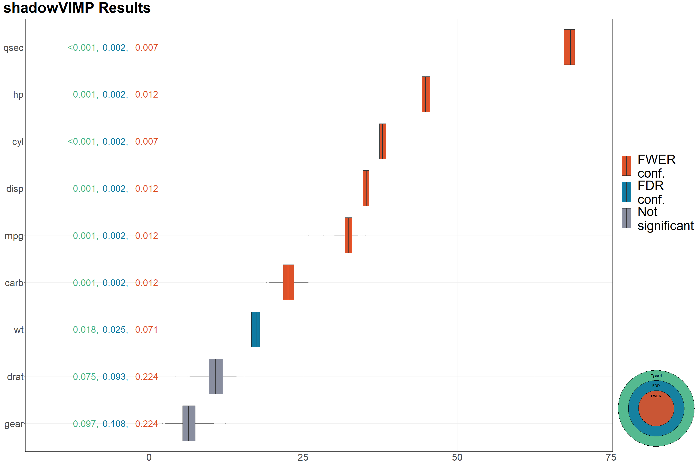

<!-- README.md is generated from README.Rmd. Please edit that file -->

# shadowVIMP

<!-- badges: start -->

[](https://github.com/Staburo/shadowVIMP/actions)
<!-- badges: end -->

<!-- keep`README.md` up-to-date -> use`devtools::build_readme()`-->

## Overview

`shadowVIMP` is an R package for variable selection that reduces the
number of covariates in a statistically rigorous and informed way,
identifying the most informative predictors. This package implements a
method that performs statistical tests on the Variable Importance
Measures (VIMP) obtained from the Random Forest (RF) algorithm to
determine whether each covariate is statistically significant and truly
informative. In contrast to widely used methods, such as selecting the
top *n* covariates with the highest VIMP or choosing covariates with a
VIMP above a certain threshold, the method implemented in `shadowVIMP`
allows for a statistical justification of whether a given VIMP is
sufficiently large to be unlikely due to chance. The main function of
the package, `shadow_vimp()`, outputs a table indicating whether each
covariate is informative, along with its associated (adjusted) p-values.
In addition, the `plot_vimps()` function provides a convenient way to
visualise the VIMPs obtained from the algorithm, including unadjusted,
FDR- and FWER-adjusted p-values. Details on the method, a realistic
example of its usage, and guidance on interpreting the results can be
found in the vignette: `vignette("shadowVIMP-vignette")`.

## Installation

The `shadowVIMP` package can be installed in the following way::

``` r
install.packages("shadowVIMP")
```

## Usage

Imagine you are working with a dataset with many variables and you want
to select the subset of the most informative covariates. Instead of
computing the variable importance, displaying it on variable importance
plots, and (somewhat arbitrarily) selecting the set of informative
features, you can use the method implemented in this package and select
the subset of features in a more robust way. The following example shows
the basic use case.

``` r
library(shadowVIMP)
library(magrittr)
library(ggplot2)

data(mtcars)

# For reproducibility
set.seed(789)
# Value of num.threads parameter
global_num_threads <- 1

# Standard usage
# WARNING 1: When working with real data, increase the value of the niters parameter or leave it at the default value.
# WARNING 2: To avoid potential issues with using multiple threads on CRAN, we set num.threads to 1, by default it is set to half of the available threads, which speeds up computation.
vimp_seq <- shadow_vimp(data = mtcars, outcome_var = "vs", niters = c(30, 100, 150), num.threads = global_num_threads)

# Summary of the results
vimp_seq
#> shadowVIMP Result
#> 
#> Call:
#>  shadow_vimp(niters = c(30, 100, 150), data = mtcars, outcome_var = "vs", num.threads = global_num_threads) 
#> 
#>    Step Alpha Retained Covariates
#>  Step 1  0.30                  10
#>  Step 2  0.10                   9
#>  Step 3  0.05                   7
#> 
#> Count of significant covariates from step 3 per p-value correction method using the pooled approach
#>  Type-1 Confirmed FDR Confirmed FWER Confirmed
#>                 7             7              6

# Print informative covariates according to the pooled criterion (with and without p-value correction)
vimp_seq$final_dec_pooled
#>   varname      p_unadj   p_adj_FDR  p_adj_FWER Type1_confirmed FDR_confirmed
#> 1     cyl 0.0007401925 0.002467308 0.007401925               1             1
#> 2    qsec 0.0007401925 0.002467308 0.007401925               1             1
#> 3     mpg 0.0014803849 0.002467308 0.011843079               1             1
#> 4    disp 0.0014803849 0.002467308 0.011843079               1             1
#> 5      hp 0.0014803849 0.002467308 0.011843079               1             1
#> 6    carb 0.0014803849 0.002467308 0.011843079               1             1
#> 7      wt 0.0177646188 0.025378027 0.071058475               1             1
#> 8    drat 0.0747594375 0.093449297 0.224278312               0             0
#> 9    gear 0.0969652110 0.107739123 0.224278312               0             0
#>   FWER_confirmed
#> 1              1
#> 2              1
#> 3              1
#> 4              1
#> 5              1
#> 6              1
#> 7              0
#> 8              0
#> 9              0

# The significance level used in each step of the procedure:
vimp_seq$alpha
#> [1] 0.30 0.10 0.05

# Were all covariates deemed insignificant at any step of the pre-selection? If so, which step?
# If `step_all_covariates_removed == 0`, then at least one covariate survived the pre-selection
vimp_seq$step_all_covariates_removed
#> [1] 0

# Check the time needed to execute each step of the algorithm and the entire procedure
vimp_seq$time_elapsed
#> $step_1
#> [1] 0.1694246
#> 
#> $step_2
#> [1] 0.481499
#> 
#> $step_3
#> [1] 0.7132612
#> 
#> $total_time_mins
#> [1] 1.364185

# Check the call code that was used to create the inspected object
vimp_seq$call
#> shadow_vimp(niters = c(30, 100, 150), data = mtcars, outcome_var = "vs", 
#>     num.threads = global_num_threads)

# Check the VIMPs of the covariates and their shadows from the last step of the procedure
vimp_seq$vimp_history %>% head()
#>        mpg      cyl     disp       hp     qsec     carb       wt      drat
#> 1 32.96580 37.83467 34.28494 44.40825 69.39776 24.06262 15.92240  6.592342
#> 2 33.94531 37.67475 33.80626 43.52956 69.47350 22.87792 15.14960 11.407349
#> 3 30.08375 37.37923 35.83397 45.54814 63.48126 21.02905 19.53125  9.903495
#> 4 32.87286 37.27228 33.33198 44.62708 66.72462 21.53476 16.72543 12.559785
#> 5 33.31543 37.87766 35.51419 46.53287 68.73776 23.26442 16.94575 11.323333
#> 6 32.14069 37.56510 34.74886 45.31037 67.73211 22.76118 17.46005 10.717524
#>       gear mpg_permuted cyl_permuted disp_permuted hp_permuted qsec_permuted
#> 1 5.764364    -6.069204  -3.32899537    -8.1562793    7.681771     16.844710
#> 2 4.598629     4.078202   2.89716983    13.9188568   18.325314     -4.697359
#> 3 6.940662    -3.242185   2.70553361     4.3478057   -1.002965     -3.033623
#> 4 8.191079     8.515609  -0.06092051     0.2708662   -5.778261      2.359071
#> 5 7.602294    -5.753136   0.34546070    -4.3777628    3.339719     16.449674
#> 6 7.541206    -5.267411  -0.50446983    -4.0950592   -1.733074     -5.538990
#>   carb_permuted wt_permuted drat_permuted gear_permuted
#> 1    -3.2699946   -6.661017     -2.508818     3.3687412
#> 2    -2.8813075   -1.537203     -8.378585    -1.6538532
#> 3    -4.7045122    9.585241     28.771112     7.1048423
#> 4    11.3272227    2.210888      1.430094    -2.1331894
#> 5     0.8828882   -6.429090     -4.002469     0.4812786
#> 6     0.1989782   -6.730972     -6.458763    -2.7823118

# Inspect in detail two steps of pre-selection
#  vimp_seq$pre_selection$step_1
#  vimp_seq$pre_selection$step_2
```

You can visualize your results in the following way:

``` r
plot_vimps(
  shadow_vimp_out = vimp_seq,
  text_size = 10,
  legend.text = element_text(size = 40),
  axis.text = element_text(size = 30)
) +
  patchwork::plot_annotation(
    title = "shadowVIMP Results",
  ) &
  theme(plot.title = element_text(size = 45, face = "bold"))
```



For a more realistic and detailed example of how to use this package,
and the theory behind the method, see `vignette("shadowVIMP-vignette")`.

## Getting help

If you encounter a clear bug, please file an issue with a minimal
reproducible example.
